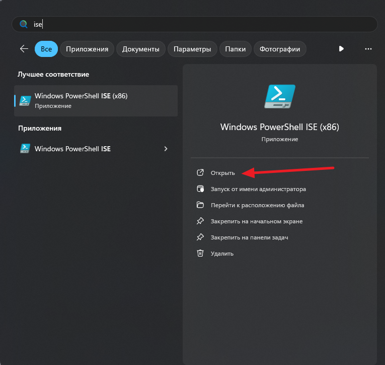

# PowerShell

## Следуйте инструкции <a href="#user-content-1-sozdaite-papku-s-nazvaniem-v-vide-imeni-budushego-plagina" id="user-content-1-sozdaite-papku-s-nazvaniem-v-vide-imeni-budushego-plagina"></a>

1\. Создайте папку с _названием в виде имени будущего плагина._

Далее можете продолжить следовать инструкции или скачать готовый пример и на его основе создать свой плагин. Чтобы установить данный плагин, не распаковывая, перетащите файл на список установленных плагинов. Для просмотра и редактирования рекомендую воспользоваться архиватором [7-Zip](https://www.7-zip.org/) со сжатием **Нормальное.**


Пример готового плагина


2\. В данной папке (далее в гайде просто **main\_folder**)


**{main\_folder}** = **main\_folder**. Все переменные в гайде обозначаются в фигурных скобках.


3\. Создайте следующую структуру файлов:

```
{main_folder}\main.manifest
{main_folder}\main.ps1
```


Вы также можете создать файл **setup.ps1** (`{main_folder}\setup.ps1`) и записать в данный файл PowerShell код, который необходимо выполнить сразу по окончании устаеновки плагина и до его первого запуска.


4\. В файл **main.manifest** (текстовый файл манифеста плагина с надстройками) вставьте следующий текст:


```ini
chat_action_type = 1
message_type = 1
arguments_count = 0
```



### **Описание**

**chat\_action\_type** - тип действия, которое будет написано в чате во время работы файла

_Значения_

* 0 - ничего не писать
* 1 - "Бот набирает сообщение..".

**message\_type** - тип возвращаемого сообщения в Telegram бота

_Значения_

* 0 - Текстовое сообщение
* 1 - Текстовое сообщение с поддержкой HTML форматирования
* 2 - Ничего не возвращать

**arguments\_count** - количество обязательных принимаемых аргументов плагина от пользователя

_Значения_

* От 0 до 4


5\. Основной код необходимо написать в файле **main.ps1** (файл кода написанный для _PowerShell_). Можно создать и редактировать с помощью _Windows PowerShell ISE_, который встроен в Windows, или воспользоваться другим удобным для вас редактором кода, рекомендую Visual Studio Code.

<figure><figcaption><p>Запуск встроенной в Windows среды разработки PowerShell ISE</p></figcaption></figure>


Если Вы хотите использовать русский язык в каких-то фрагментах кода (например, вывод текста), то редактируйте файл в Notepad++ (или прямо в Visual Studio Code) в кодировке UTF-8.


<figure><figcaption><p>Проверка кодировки файла скрипта PowerShell</p></figcaption></figure>

6\. Вставьте в файл **main.ps1** следующий код (базовый пример):


```powershell
#app {plugin_name}, Version="{plugin_version}", Author={author}, Command={call_command}

function MainFunc($arg1, $arg2, $arg3, $arg4) {
    Write "Привет Мир! Ниже идёт тестовый подсчёт (3+4)"
    3+4
}
```



Для вывода текста в Telegram бота используйте команду _**Write**_ в коде плагина, либо, если это текст в конце кода, то можете просто написать что нужно вывести, как это сделано в примере.


7\. Заполните данные (всё без пробелов):

* **{plugin\_name}** - название плагина, такое же как для **{main\_folder}**
* **{plugin\_version}** - версия в формате x.x.x.x, где x - число (например: 1.0.0.4)
* **{author}** - автор плагина
* **{call\_command}** - команда для вызова плагина (обязательно начинается с **/**), например: /hello

Должно получиться что-то похожее: `#app HelloWorld, Version="1.0.0.0", Author=developer, Command=/hello`


Данная строка является обязательной для файла плагина!


8\. Создайте zip архив с папкой **{main\_folder}** (рекомендую воспользоваться архиватором [7-Zip](https://www.7-zip.org/) со сжатием **Нормальное**)

[](https://user-images.githubusercontent.com/51060911/191972666-a2732f62-6bf0-4ff8-9e4c-eeaee52e6f08.png)


Нужно заархивировать не саму папку, а её содержимое!


9\. Переименуйте файл в **{main\_folder}** и измените расширение архива на `srp`

10\. Установите файл через Shark Remote.

11\. Тестируйте!


Вес установочного файла плагина (созданного архива) должен не превышать 10 мегабайт, иначе установить будет нельзя. Однако, если вы точно уверены в своём плагине, то можно использовать флаг `big-bang=1` ([подробнее](../settings/flags.md))

