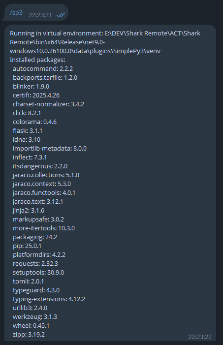

# Python


Перед началом разработки рекомендуется проверить настройку `use_installed_python_for_plugins`, см. ниже (лучше, через Ctrl+F) или в [отдельной главе](../settings/main.toml.md).


## Следуйте инструкции <a href="#user-content-1-sozdaite-papku-s-nazvaniem-v-vide-imeni-budushego-plagina" id="user-content-1-sozdaite-papku-s-nazvaniem-v-vide-imeni-budushego-plagina"></a>

1\. Создайте папку с _названием в виде имени будущего плагина._

Далее можете продолжить следовать инструкции или скачать готовый пример и на его основе создать свой плагин. Чтобы установить данный плагин, не распаковывая, перетащите файл на список установленных плагинов. Для просмотра и редактирования рекомендую воспользоваться архиватором [7-Zip](https://www.7-zip.org/) со сжатием **Нормальное.**


Пример готового плагина



Установленный плагин **SimplePy3** активируется командой **/sp3** и выводит список установленных библиотек в виртуальном окружении (venv). Для теста, прописана установка `Flask` и `requests`. Во время установки плагина будут появляться окна консоли, ожидайте пока процесс завершится и не будет написано **Press the Enter key to continue...**\
\
Ниже представлен примерный вывод после работы команды **/sp3**




2\. В данной папке (далее в гайде просто **main\_folder**)


**{main\_folder}** = **main\_folder**. Все переменные в гайде обозначаются в фигурных скобках.


3\. Создайте следующую структуру файлов:

```
{main_folder}\main.manifest
{main_folder}\main.py
```


Вы также можете создать файл **setup.py** (`{main_folder}\setup.py`) и записать в данный файл PowerShell код, который необходимо выполнить сразу по окончании устаеновки плагина и до его первого запуска.

Если требуются какие-то сторонние библиотеки, то их необходимо описать в файле **requirements.txt** (`{main_folder}\requirements.txt`). В данном случае, будет создано отдельное виртуальное окружение только для вашего плагина, в которое будут установлены все необходимые библиотеки с помощью **pip**.



Виртуальное окружение (venv) будет создано и использоваться, только, если имеется файл **requirements.txt** с пакетами-зависимостями. Иначе – будет просто использован портативный Python. Можно использовать настройку `use_installed_python_for_plugins = true` и тогда будет использоваться установленный вами Python для запуска плагина или для создания _venv_.

Портативный Python скачивается, только при установке хотя бы одного плагина. \
**Python совершенно не является обязательным для Shark Remote.**


4\. В файл **main.manifest** (текстовый файл манифеста плагина с надстройками) вставьте следующий текст:


```ini
chat_action_type = 1
message_type = 1
arguments_count = 0
```



### **Описание**

**chat\_action\_type** - тип действия, которое будет написано в чате во время работы файла

_Значения_

* 0 - ничего не писать
* 1 - "Бот набирает сообщение..".

**message\_type** - тип возвращаемого сообщения в Telegram бота

_Значения_

* 0 - Текстовое сообщение
* 1 - Текстовое сообщение с поддержкой HTML форматирования
* 2 - Ничего не возвращать

**arguments\_count** - количество обязательных принимаемых аргументов плагина от пользователя

_Значения_

* От 0 до 4


5\. Основной код можно написать в файле **main.py** в любом текстовом редакторе или редакторе кода. Рекомендуется Visual Studio Code.

6\. Вставьте в файл **main.py** следующий код (базовый пример):


```python
#app {plugin_name}, Version="{plugin_version}", Author={author}, Command={call_command}

import sys

def main():
    args = sys.argv[1:]
    print(f"SimplePlugin: {len(args)} args: {', '.join(args) if args else 'None'}")
    
if __name__ == "__main__":
    main()
```



Для вывода текста в Telegram бота используйте команду **print** в коде плагина.


7\. Заполните данные (всё без пробелов):

* **{plugin\_name}** - название плагина, такое же как для **{main\_folder}**
* **{plugin\_version}** - версия в формате x.x.x.x, где x - число (например: 1.0.0.4)
* **{author}** - автор плагина
* **{call\_command}** - команда для вызова плагина (обязательно начинается с **/**), например: /hello

Должно получиться что-то похожее: `#app HelloWorld, Version="1.0.0.0", Author=developer, Command=/hello`


Данная строка является обязательной для файла плагина!


8\. Создайте zip архив с папкой **{main\_folder}** (рекомендую воспользоваться архиватором [7-Zip](https://www.7-zip.org/) со сжатием **Нормальное**)

[](https://user-images.githubusercontent.com/51060911/191972666-a2732f62-6bf0-4ff8-9e4c-eeaee52e6f08.png)


Нужно заархивировать не саму папку, а её содержимое!


9\. Переименуйте файл в **{main\_folder}** и измените расширение архива на `srp`

10\. Установите файл через Shark Remote.

11\. Тестируйте!


Размер установочного файла плагина (созданного архива) должен не превышать 10 мегабайт, иначе установить будет нельзя. Однако, если вы точно уверены в своём плагине, то можно использовать настройку `install_plugins_without_limits` ([подробнее](../settings/main.toml.md))

