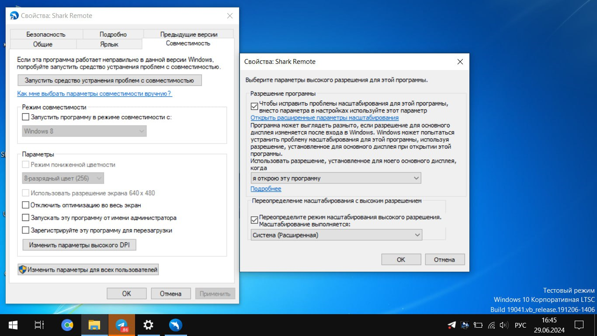

# Размер окон Shark Remote

Через файл **form\_size.txt** можно принудительно задавать размер основного окна Shark Remote и Мастера настройки. Например, в данный файл можно записать приведённый ниже текст, либо сгенерировать его аргументом запуска `--init-size`

_Настройки_


```
{Width=757, Height=362}
{Width=547, Height=409}
```



Первые 2 значения равны ширине и высоте основного окна, а следующие 2 значения (ниже) равны ширине и высоте окна Мастера настройки.

Желательно также, чтобы значения были не слишком большие и не слишком маленькими (изначальные значения окон заданы в примере).



Изменять необходимо только числовые значения!



Вы можете показать разработчику в чём проблема использовав P**reloaderDebugMode**\
1\. Убедитесь что файл **.preloader** существует в папке с программой. Если нет – создайте.\
2\. Просто запустите приложение и дождитесь запуска Telegram бота (если не включается автоматически – включите вручную)\
3\. Откройте панель _О приложении_ и кликните на Shark Remote с зажатым Alt.

\
4\. Вставьте и отправьте полученный текст из буфера разработчику.


Ещё одним решением может стать изменение **Параметров высокого DPI**. Выключите перед этим настройки исправления отображения в Shark Remote, если применили их ранее.<br>

<figure><figcaption><p>Расположение настроек высокого разрешения</p></figcaption></figure>
