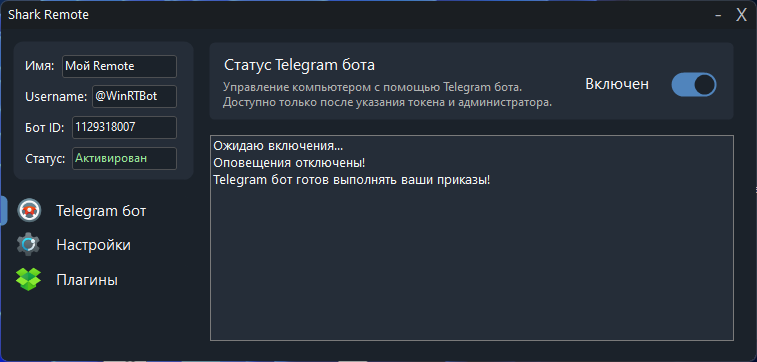

# Начальная настройка (Мастер настройки)


Если вы просто распаковали Shark Remote в папку – данный гайд для вас.

Если установили  – настройка должна была произойти автоматически во время установки.



Имеется также иной способ настройки – через [WebUI](../settings/).


Начнём пожалуй:

1. Запустите Shark Remote.exe (основной файл Shark Remote)
2. Согласитесь с [Условиями использования](https://sharkremote.neocities.org/terms-of-use)

<figure><figcaption>
Первый этап настройки
</figcaption></figure>

3. Следуя инструкции, создайте Telegram бота в @BotFather и скопируйте токен бота. Нажмите кнопку "Вставить токен" для привязки бота к Shark Remote

<figure><figcaption>
Второй этап настройки
</figcaption></figure>

<figure><figcaption>
Пример токена
</figcaption></figure>

<figure><figcaption>
Сообщение об успехе
</figcaption></figure>

4. Скопируйте свой username

<figure><figcaption>
Финальный этап настройки
</figcaption></figure>

<figure><figcaption>
Где найти в Telegram?
</figcaption></figure>

5. Вставьте используя кнопку "V"
6. Нажмите на кнопку "Завершить настройку"
7. Нажмите на кнопку "Запустить Shark Remote" и Shark Remote будет перезапущен и откроется основное окно приложения. Telegram бот будет запущен полностью автоматически.

<figure><figcaption>
Внешний вид программы
</figcaption></figure>

5. Настройка завершена!
