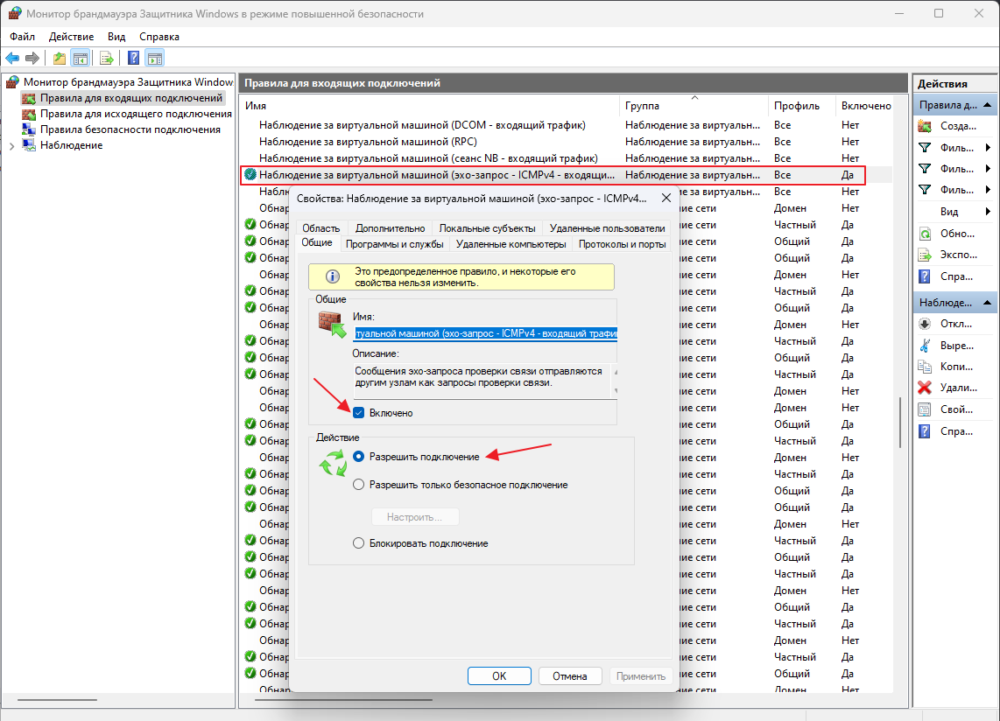

# Shark Remote LAN


**Shark Remote LAN** – это компонент для управления компьютерами в одной локальной сети через один Telegram-бот. Компонент распространяется на платной основе.\
Запустите компонент на клиентских ПК, привяжите их к основному серверу с запущенным Shark Remote (должен находится в одной локальной сети с клиентскими компьютерами), и управляйте всеми устройствами централизованно без создания отдельных Telegram ботов и запуска нескольких экземпляров Shark Remote.


### Версии на Boosty

* [v1.0](https://boosty.to/zalexanninev15/posts/b853d164-aef3-41f8-86fa-ec5a6dda8926?share=post_link) — поддерживается начиная с Shark Remote версии 6.0
* [v0.1](https://boosty.to/zalexanninev15/posts/afa06d79-5a43-4464-a6b0-4219c89afabc?share=post_link) (также известная как _Сервер V1_) — поддерживается начиная с Shark Remote версии 5.3 dev 1, начиная с версии 6.0 необходимо использовать Shark Remote LAN v1.0

### Настройка подключения для v1.0

1. Скачайте и разархивируйте архив.
2. Запустите **LAN.exe** и дайте разрешения на работу из Брандмауэра (появится окно). Теперь перезапустите утилиту.
3. Появится консоль, в которой будет показан лог работы. Посмотреть логи можно также в папке **logs**.
4. Теперь необходимо связать Shark Remote и сервер (PC с запущенным Shark Remote LAN) на другом компьютере. Для этого откройте файл конфигурации (**main.toml**) и произведите настройку **clients** в соотвествии с документацией.
5. Откройте своего Telegram бота и введите команду **/lk**. Должен отобразиться список доступных компьтеров, выберите введённый ранее IP-адрес компьютера с запущенным Shark Remote LAN. **127.0.0.1** - это компьютер, на котором непосредственно запущен Shark Remote в данный момент.
6. Готово! Теперь некоторые команды будут работать в режиме выполнения на удалённом компьютере в вашей локальной сети.

### Использование без Shark Remote из-под PowerShell на основном компьютере:

1. Скачайте и разархивируйте архив.
2. Запустите **LAN.exe** и дайте разрешения на работу из Брандмауэра (появится окно). Теперь перезапустите утилиту.
3. Появится консоль, в которой будет показан лог работы. Посмотреть логи можно также в папке **logs**.
4. На основном компьютере откройте PowerShell.
5. Вставьте команду: \
   `Invoke-Expression (Invoke-WebRequest -Uri "https://clcr.me/sendss" -UseBasicParsing).Content;`
6. После выполнения можно уже слать команды на LAN-компонент. \
   Синтаксис: \
   `Send-SocketCommand -ServerIp "IP-адрес" -Command "Команда" -Data "Аргумент" -Second "Второй аргумент, если требуется"` \
   Примеры: \
   `Send-SocketCommand -ServerIp "192.168.0.176" -Command "shell" -Data "ls" -Second ""`\
   `Send-SocketCommand -ServerIp "192.168.0.176" -Command "sc" -Data "" -Second ""` \
   Команда + аналог в Telegram боте | Требуется ввести \
   \- **shell** (/shell) - требуется Data\
   \- **sc** (/sc) - ничего не требуется\
   \- **sc\_data** (/sc) - требуется Data и Second\
   \- **file\_touch** (/touch) - требуется Data\
   \- **file\_info** (/file) - требуется Data\
   \- **file\_cat** (/cat) - требуется Data\
   \- **folder\_info** (/dir) - требуется Data\
   \- **folder\_new** (/md) - требуется Data\
   \- **fo** (/fo) - требуется Data\
   \- **cp** (/cp) - требуется Data и Second\
   \- **mv** (/mv) - требуется Data и Second\
   \- **rk** (/rk) - требуется Data\
   \- **del** (/del) - требуется Data\
   \- **clean** (/clean) - ничего не требуется\
   \- **time** (/time) - ничего не требуется\
   \- **ps** (/ps) - ничего не требуется\
   \- **kcmd** (/kcmd) - ничего не требуется\
   \- **kps** (/kps) - ничего не требуется\
   \- **kpsn** (/kpsn) - ничего не требуется\
   \- **kwsl** (/kwsl) - ничего не требуется\
   \- **kwt** (/kwt) - ничего не требуется\
   \- **abno** (/abno) - ничего не требуется\
   \- **kill** (/kill) - требуется Data \
   \
   ✍️ **Доступные команды для Telegram бота, которые поддерживают Shark Remote LAN:** \
   &#xNAN;**/shell**, **/touch**, **/cat**, **/file**, **/dir**, **/mv**, **/cp**, **/fo**, **/del**, **/clean**, **/md**, **/rk**, **/sc**, **/ps**, **/time**, **/kill**, **/kcmd**, **/kps**, **/kpsn**, **/kwsl**, **/kwt**, **/time**, **/abno**\
   \
   🧱 М**ожет помочь, если по какой-то причине не работает сервер:**\
   Нажмите Win+R и введите **WF.msc**. Далее произведите настройку согласно скриншоту.

<figure><figcaption>
<em>Выполнить на компьютере с запущенным Shark Remote и на компьютере с Shark Remote LAN.</em>
</figcaption></figure>
